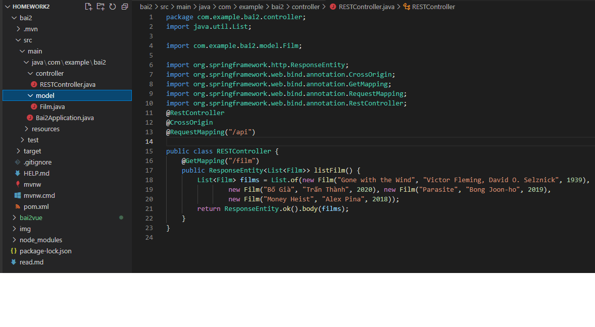
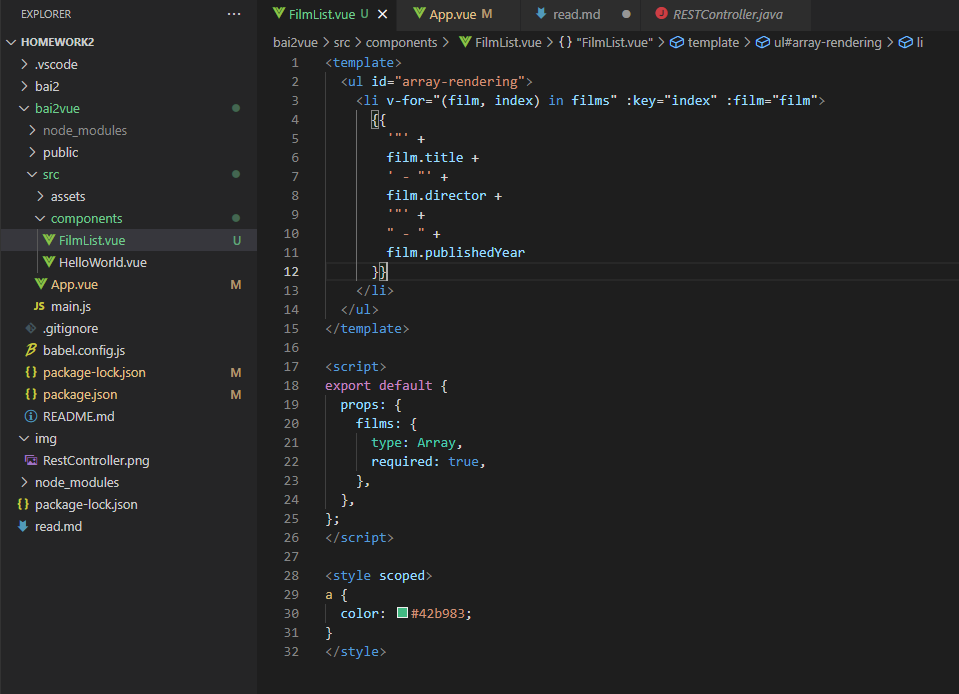
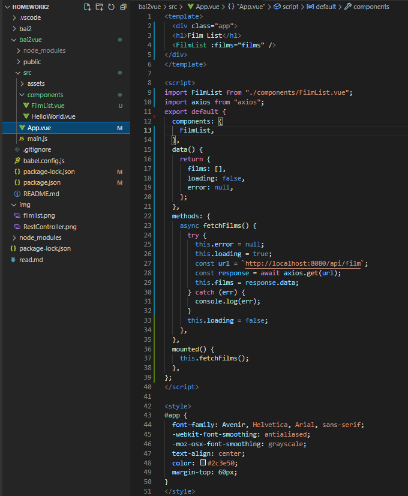
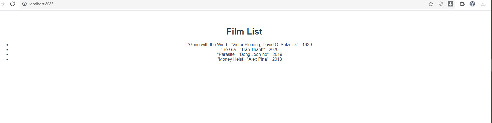

BÀI TẬP: Client Side Rendering with Vue JS
Bước 1: khởi tạo project "bai2" SpringBoot qua Maven
Bước 2: Tạo class film và RESTController
- Trong thư mục bai2/src/main/java :
  + Tạo thêm 2 thư mục mới là model và controller 
  + Trong thư mục model tạo thêm file "Film.java"
  + Trong Film.java tạo class Film với 3 trường `title`, `director`, và `publishedYear`. Khai báo getter, setter, constructor chứa đầy đủ 3 trường
  + Trong thư mục comtroller tạo file "RESTController.java"
  + Trong "RESTController.java" tạo các đường dẫn liên kết "/api" & "/film"
  
Bước 3: Run File "Bai2Application.java" & test Postman
Bước 4: Tạo project "bai2vue" bằng vue3
Bước 5: Tạo file FilmList.vue trong bai2vue/src/components
Bước 5: Chỉnh sửa file FilmList.vue & App.vue
  
  
Bước 6: Chạy lệnh "npm run serve" trong Terminal .../bai2vue
Bước 7: Xem kết quả trình duyệt
  