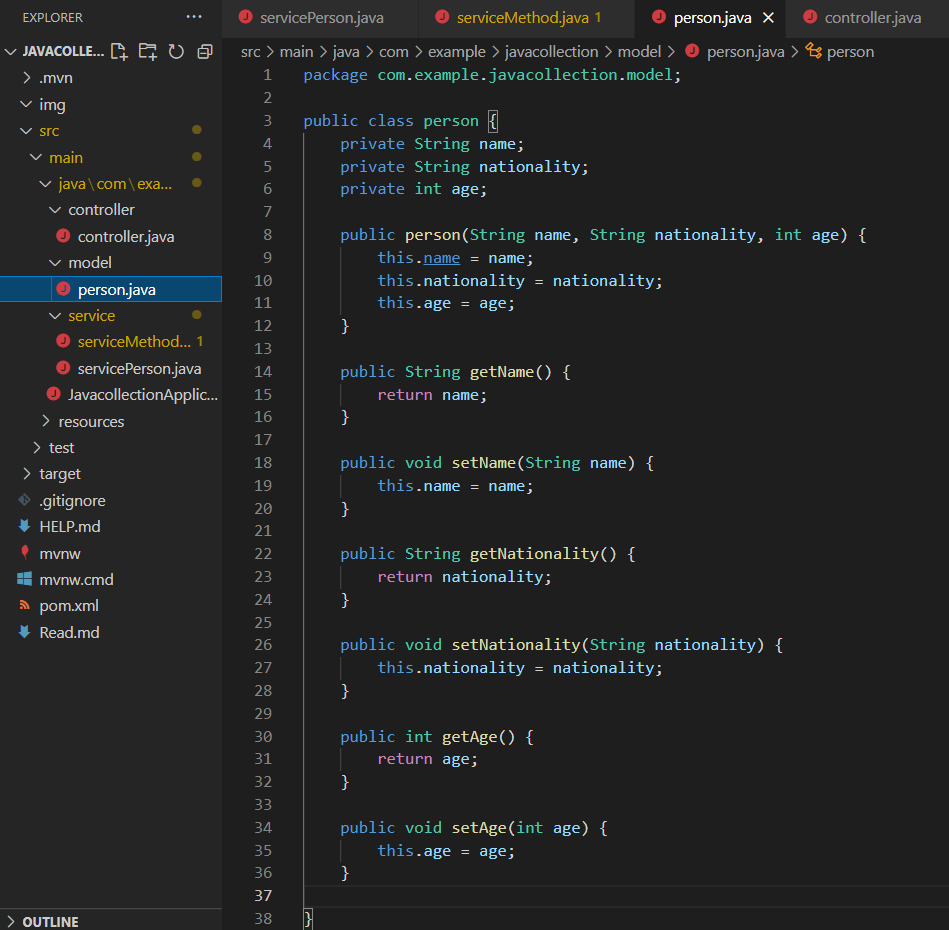
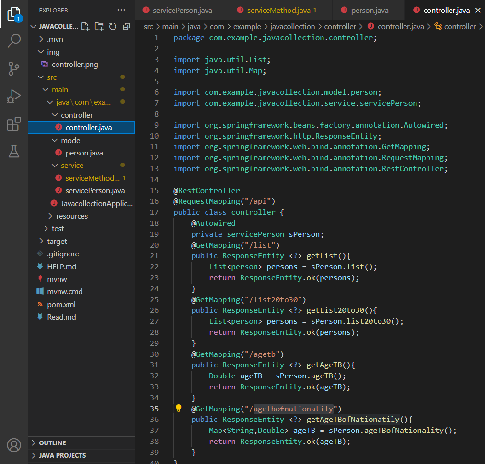
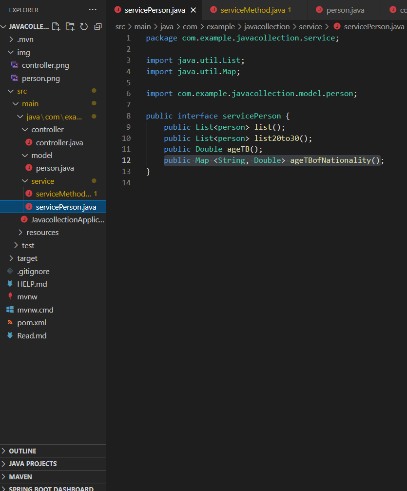
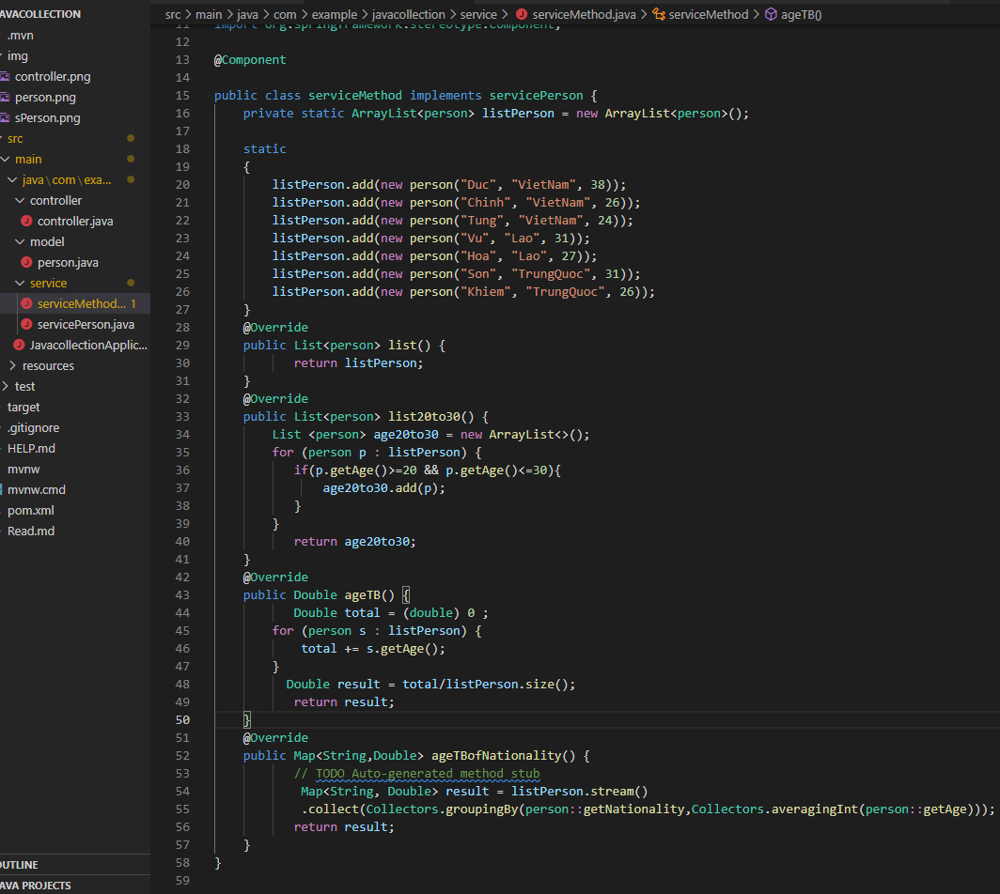
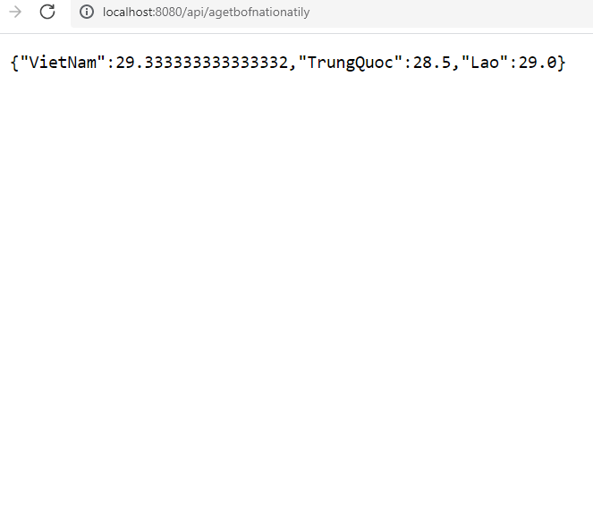

# 2. Thực hành Java Collection
- Bước 1 : Tạo 1 project SpringBoot 
- Bước 2 : Tạo thêm cái file "controller.java","person.java","seveiceMethod.java","seveicePerson.java"**
    - tạo file person.java
    
    - tạo file controller.java
    
    - tạo seveicePerson.java
     
    - tạo file seveiceMethod.java
    
- Bước 3 : Run chương trình và kiểm tra kết quả ở trình duyệt
    