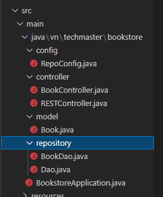

# Yêu cầu thực hiện các method HTTP

- Bước 1: Tạo chương trình SpringBoot với Spring Web & Spring Boot DevTools
- Bước 2: Thêm các thư mục và File trong src/main/java/vn/techmaster/bookstore như nhìn :

- Bước 3: Tạo Constructors,Get&Set cho file Book.java vs các id ,title,description
- Bước 4: Tạo cái Category theo yêu cầu bài tập ở file Dao.java
  public abstract class Dao<T> {
  protected  List<T> collections = new ArrayList<>();

  public abstract List<T> getAll();

  public abstract Optional<T> get(int id);
 
  public abstract void add(T t);

  public abstract void update(T t);

  public abstract void deleteByID(int id);
  }
- Bước 5: Giải các logic bài tập ở file BookDao.java

  public class BookDao extends Dao<Book> {

  public BookDao() {
    collections.add(new Book(1, "7 viên ngọc rồng", "Hàng trình tìm kiếm 7 viên ngọc cũng Songoku"));
    collections.add(new Book(2, "Cuốn theo chiều gió", "Nội chiến Hoa kỳ, cuộc tình giữa Red Butler và Ohara"));
    collections.add(new Book(3, "Cô bé bán diêm", "Cô bé cô đơn giữa đêm giáng sinh"));
    collections.add(new Book(5, "Tấm Cám", "Bống bống bang bang"));
  }

  @Override
  public List<Book> getAll() {
    return collections;
  }

  @Override
  public Optional<Book> get(int id) {
    // TODO Auto-generated method stub
    for (Book book : collections) {
      if (book.getId() == id) {
        return Optional.of(book);
      }
    }
    //return collections.stream().filter(p -> (p.getId() == id)).findFirst();
   return null; 
  }

  @Override
  public void add(Book t) {
    String s = "Trùng mã ID";
    for (int i = 0; i < collections.size(); i++) {
      if (collections.get(i).getId() == t.getId()){
        t = new Book(t.getId(),s,s);
      }
      }
      collections.add(t);
  }

  @Override
  public void update(Book t) {
    // // TODO Auto-generated method stub
    Optional<Book> findBook = collections.stream().filter(p -> (p.getId() == t.getId())).findFirst();
    if (findBook.isPresent()) {
      Book book = findBook.get();
      int index = collections.indexOf(book);
      collections.set(index, t);
    } else {
      collections.add(t);
    }
   
  }

  @Override
  public void deleteByID(int id) {
    for (int i = collections.size()-1; i >= 0; i--) {
      if(collections.get(i).getId() == id){
        collections.remove(collections.get(i));
        break;
      }
    }
  }

}
- Bước 6: Thực hiện các lệnh Get, Put, Post, Delete ở file RESTController.java
  @Controller
@RequestMapping("/book")
public class RESTController {
  @Autowired
  private Dao<Book> bookDao;

  @GetMapping
 public ResponseEntity<List<Book>> getListBook(){
   List<Book> listBook = bookDao.getAll();
//    return ResponseEntity.status(HttpStatus.OK).body(listBook);
    return ResponseEntity.ok().body(listBook);
 }

 @GetMapping("/{id}")
 public ResponseEntity<Book> getBookById(@PathVariable int id){
    Optional<Book> bookOptional = bookDao.get(id);
    Book book = null;
    if (bookOptional.isPresent()) {
        book = bookOptional.get();
    }
    return ResponseEntity.ok().body(book);
 }

 @PostMapping("/add")
 public ResponseEntity<List<Book>> createBook(@RequestParam int id, @RequestParam String title, @RequestParam String description){
   Book newBook = new Book(id, title, description);
   bookDao.add(newBook);
   List<Book> listBook = bookDao.getAll();
   return ResponseEntity.status(HttpStatus.CREATED).body(listBook);
 }

 @PutMapping("/update")
 public ResponseEntity<List<Book>> updateBook(@RequestParam int id, @RequestParam String title, @RequestParam String description){
  Book newBook = new Book(id, title, description);
  bookDao.update(newBook);
  List<Book> listBook = bookDao.getAll();
  return ResponseEntity.status(HttpStatus.OK).body(listBook);
 }

 @DeleteMapping("/{id}")
 public ResponseEntity<List<Book>> deleteBook(@PathVariable int id){
   bookDao.deleteByID(id);
   List<Book> listBook = bookDao.getAll();
   return ResponseEntity.status(HttpStatus.OK).body(listBook);
 }
}
- Bước 7: Test kết quả ở PostMan với các lệnh Get, Put, Post, Delete