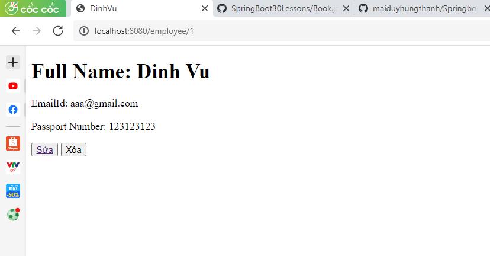

### Cấu trúc thư mục
```
.
├── main
│   ├── java
│   │   ├── vn
│   │   │   ├── techmaster
│   │   │   │   ├── lesson7
│   │   │   │   │   ├── config
│   │   │   │   │   │   └── RepoConfig.java
│   │   │   │   │   ├── controller
│   │   │   │   │   │   └── StaffController.java
│   │   │   │   │   ├── model
│   │   │   │   │   │   └── Staff.java
│   │   │   │   │   ├── repository
│   │   │   │   │   │   ├── StaffDao.java
│   │   │   │   │   │   └── Dao.java
│   │   │   │   │   └── Lesson7Application.java
│   ├── resources
│   │   ├── static
│   │   ├── templates
│   │   │   └── allbooks.html
│   │   └── application.properties
```


### 1. Khởi tạo dự án SpringBoot
Chọn các dependencies sau đây:
1. spring-boot-starter-web
2. spring-boot-devtools
3. spring-boot-starter-thymeleaf
4. Project Lombok

### 2. Xây dựng mô hình
Tạo thư mục model
Tạo file Employee.java
```java
import com.fasterxml.jackson.annotation.JsonIgnore;

import lombok.AllArgsConstructor;
import lombok.Data;
import lombok.NoArgsConstructor;

@Data
@NoArgsConstructor
@AllArgsConstructor
public class Employee {
    @JsonIgnore  //Bỏ qua id khi nạp từ CSV
    int id;
    String firstName;
    String lastName;
    String email;
    String passportNumber;
    @JsonIgnore
    String fullName;

    public void provideFullName() {
        this.fullName = String.join(" ", this.firstName, this.lastName);
    }
    
    public boolean matchWithKeyword(String keyWord){
        String keyWordLowerCase = keyWord.toLowerCase();
        return firstName.toLowerCase().contains(keyWordLowerCase) ||
        lastName.toLowerCase().contains(keyWordLowerCase) ||
        email.toLowerCase().contains(keyWordLowerCase) ||
        fullName.toLowerCase().contains(keyWordLowerCase);
    }
}
```
### 3. Định nghĩa abstract class Dao.java

```java
public abstract class Dao<T> {
  protected  List<T> collections = new ArrayList<>();

  public abstract List<T> getAll();

  public abstract Optional<T> get(int id);
 
  public abstract void add(T t);

  public abstract void update(T t);

  public abstract void deleteByID(int id);

  public abstract void delete(T t);  
}
```

### 4. Tạo một class EmployeeDao hiện thực hoá Dao
Thêm đoạn này vào pom.xml
<dependency>
  <groupId>com.fasterxml.jackson.dataformat</groupId>
  <artifactId>jackson-dataformat-csv</artifactId>
</dependency>
```java
import java.io.File;
import java.io.FileReader;
import java.io.IOException;
import java.io.Reader;
import java.util.List;
import java.util.Optional;
import java.util.stream.Collectors;

import com.fasterxml.jackson.databind.MappingIterator;
import com.fasterxml.jackson.databind.ObjectReader;
import com.fasterxml.jackson.dataformat.csv.CsvMapper;
import com.fasterxml.jackson.dataformat.csv.CsvSchema;

import org.springframework.util.ResourceUtils;

import vn.techmaster.lesson7.model.Employee;


public class EmployeeDao extends Dao<Employee> {

    public EmployeeDao(String csvFile){
        this.readCSV(csvFile);
        // AtomicInteger count = new AtomicInteger();
        listEmployee.stream().forEach(emp -> {
            emp.provideFullName();
            // emp.setId(count.incrementAndGet());
        });
    }

    @Override
    public void readCSV(String csvFile) {
        // TODO Auto-generated method stub
        try {
            File file = ResourceUtils.getFile("classpath:static/" + csvFile);
            CsvMapper mapper = new CsvMapper(); // Dùng để ánh xạ cột trong CSV với từng trường trong POJO
            CsvSchema schema = CsvSchema.emptySchema().withHeader(); // Dòng đầu tiên sử dụng làm Header
            ObjectReader oReader = mapper.readerFor(Employee.class).with(schema); // Cấu hình bộ đọc CSV phù hợp với kiểu
            Reader reader = new FileReader(file);
            MappingIterator<Employee> mi = oReader.readValues(reader); // Iterator đọc từng dòng trong file
            while (mi.hasNext()) {
              Employee employee = mi.next();
              this.add(employee);
            }
          } catch (IOException e) {
            System.out.println(e);   
          }
    }

    @Override
    public List<Employee> getAll() {
        // TODO Auto-generated method stub
        return listEmployee;
    }

    @Override
    public Optional<Employee> get(int id) {
        // TODO Auto-generated method stub
        return listEmployee.stream().filter(u -> u.getId()==id).findFirst();
    }

    @Override
    public void add(Employee employee) {
        // TODO Auto-generated method stub
        //Cơ chế tự tăng id
        int id;
        if (listEmployee.isEmpty()) {
        id = 1;
        } else {
        Employee lastEmployee = listEmployee.get(listEmployee.size() - 1);
        id = lastEmployee.getId() + 1;      
        }
        employee.setId(id);
        listEmployee.add(employee);
        listEmployee.stream().forEach(emp -> emp.provideFullName());
    }

    @Override
    public void update(Employee employee) {
        // TODO Auto-generated method stub
        get(employee.getId()).ifPresent(existEmployee -> {
            existEmployee.setFirstName(employee.getFirstName());
            existEmployee.setLastName(employee.getLastName());
            existEmployee.setEmail(employee.getEmail());
            existEmployee.setPassportNumber(employee.getPassportNumber());
        });
    }

    @Override
    public void deleteById(int id){
        get(id).ifPresent(existEmployee -> listEmployee.remove(existEmployee));
    }

    @Override
    public List<Employee> searchByKeyword(String keyword){
        return listEmployee.stream()
        .filter(existEmployee -> existEmployee.matchWithKeyword(keyword))
        .collect(Collectors.toList());
    }

}
```
### 5. Xây dựng Config
Tạo 1 file employee.csv
Tạo thư mục Config
Tạo file RepoConfig.java
```java
import org.springframework.context.annotation.Bean;
import org.springframework.context.annotation.Configuration;

import vn.techmaster.lesson7.Repository.EmployeeDao;

@Configuration
public class RepoConfig {
    @Bean
    public EmployeeDao employeeDao(){
        return new EmployeeDao("employee.csv");
    }
}
```
### 6. Tạo EmployeeController
Tạo thư mục [controller](src/main/java/vn/techmaster/bookstore/controller), sau đó tạo [BookController.java](src/main/java/vn/techmaster/bookstore/controller/BookController.java)

```java
@Controller
@RequestMapping("/book")  //Đường dẫn /book sẽ là đường dẫn gốc chung cho các phương thức bên trong BookController
public class BookController {
  @Autowired
  private BookDao bookDao; //Gán Bean bookDao vào biến này

  @GetMapping
  public String listAll(Model model) {
    model.addAttribute("books", bookDao.getAll());
    return "allbooks";
  }  
}
```

### 7. Tạo Thymeleaf template
Trong thư mục [static/templates] tạo file [allbooks.html](src/main/resources/templates/allbooks.html)

Đoạn code này duyệt qua các đối tượng Book trong mảng để hiển thị
home.html
```html
<!DOCTYPE html>
<html lang="en">
<head>
    <meta charset="UTF-8">
    <meta http-equiv="X-UA-Compatible" content="IE=edge">
    <meta name="viewport" content="width=device-width, initial-scale=1.0">
    <title>Trang Chủ</title>
</head>
<body>
    <h1>DANH SÁCH NHÂN VIÊN</h1>
    <a href="/employee">Trang đầu</a>
    <a href="/employee/add">Thêm mới</a>
    <a href="/employee/search">Tìm kiếm</a><br>
    <table>
        <thead>
            <th>Id</th>
            <th>FirtName</th>
            <th>LastName</th>
            <th>FullName</th>
            <th>EmailId</th>
            <th>Passport</th>
            <th>Thông tin</th>
           
        </thead>

        <tbody>
            <tr th:each="employee, iStart : ${employees}">
                <td th:text="${iStart.index+1}"></td>
                <td th:text="${employee.firstName}"></td>
                <td th:text="${employee.lastName}"></td>
                <td th:text="${employee.fullName}"></td>
                <td th:text="${employee.emailId}"></td>
                <td th:text="${employee.passportNumber}"></td>
                <td><button><a th:href="@{/employee/{id}(id=${employee.id})}">Chi tiết</a></button></td>
            
            </tr>
        </tbody>
    </table>
</body>
</html>
```
add.html
```html
<!DOCTYPE html>
<html lang="en">
<head>
    <meta charset="UTF-8">
    <meta http-equiv="X-UA-Compatible" content="IE=edge">
    <meta name="viewport" content="width=device-width, initial-scale=1.0">
    <title>ADD</title>
</head>
<body>
    <form action="#" th:action="@{/employee/save}" th:object="${employee}" method="post">
        <input type="hidden" placeholder="Id" th:field="*{id}"><br>
        <input type="text" placeholder="First Name" required th:field="*{firstName}"/><br><br>
        <input type="text" placeholder="Last Name" required th:field="*{lastName}"/><br><br>
        <input type="text" placeholder="EmailId" required th:field="*{emailId}"/><br><br>
        <input type="text" placeholder="Passport Number" required th:field="*{passportNumber}"/><br><br>
        <button type="submit">Save</button>
</form>
</body>
</html>
```
employee.html
```html
<!DOCTYPE html>
<html lang="en">
<head>
    <meta charset="UTF-8">
    <meta http-equiv="X-UA-Compatible" content="IE=edge">
    <meta name="viewport" content="width=device-width, initial-scale=1.0">
    <title th:text="${employee.firstName} + ${ employee.lastName}"></title>
</head>
<body>
<form action="#" th:action="@{/employee/delete}" th:object="${employee}" method="post">
    <input type="hidden" th:field="*{id}">
    <h1 th:text="'Full Name: '+ ${employee.firstName} +' '+ ${employee.lastName}"></h1>
    <p th:text="'EmailId: ' + ${employee.emailId}"></p>
    <p th:text="'Passport Number: ' + ${employee.passportNumber}"></p>
    <button><a th:href="@{/employee/edit/{id}(id=${employee.id})}"> Sửa</a></button>
    
    <button type="submit">Xóa</button>
</form>
</body>
</html>
```
search.html
```html
<!DOCTYPE html>
<html lang="en">
<head>
    <meta charset="UTF-8">
    <meta http-equiv="X-UA-Compatible" content="IE=edge">
    <meta name="viewport" content="width=device-width, initial-scale=1.0">
    <title>Search</title>
</head>
<body>
    <form action="#" th:action="@{/employee/search}" method="post"
          novalidate="novalidate" th:object="${searchrequest}" >
    <input type="text" th:field="*{keyWord}" placeholder="type keyword here"/><br><br>
    <button type="submit">Search</button>
</form>
</body>
</html>
```
### 9: Biên dịch và vào http://localhost:8080/employee
Kết quả nhận được sẽ như sau



